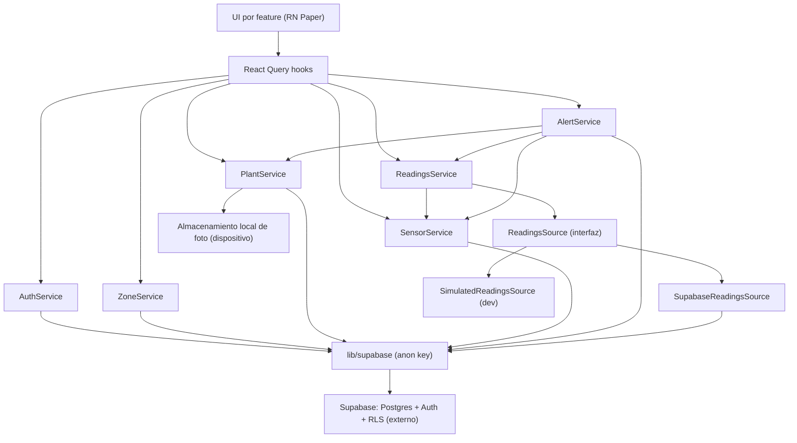

# Application Design — Component Dependencies

> Etapa 2.6 · Fase Inception · Alcance **MVP** (profundidad Estándar) · 2026-07-19
> Dependencias, flujo de datos y recursos compartidos entre los componentes de
> `components.md`. Deriva de `requirements.md`, `stories.md`, `team-practices.md`.
> Regla base (Q2=A): la UI depende de hooks → servicios; solo `lib/supabase` toca
> el SDK. Comunicación app⇄backend por **pull/polling** (C-3, RF-E2).

## Matriz de dependencias (fila depende de columna)

| depende ↓ / de → | Auth | Zone | Plant | Sensor | Readings | Alert | lib/supabase | ReadingsSource | ui | i18n | config |
|------------------|:----:|:----:|:-----:|:------:|:--------:|:-----:|:------------:|:--------------:|:--:|:----:|:------:|
| feature/auth     |  ✔   |      |       |        |          |       |              |                | ✔  | ✔    |        |
| feature/zones    |      |  ✔   |       |        |          |       |              |                | ✔  | ✔    |        |
| feature/plants   |      |  ✔   |  ✔    |  ✔     |  ✔       |       |              |                | ✔  | ✔    | ✔      |
| feature/sensors  |      |      |       |  ✔     |          |       |              |                | ✔  | ✔    |        |
| feature/dashboard|      |      |  ✔    |        |  ✔       |  ✔    |              |                | ✔  | ✔    | ✔      |
| feature/alerts   |      |      |       |        |  ✔       |  ✔    |              |                | ✔  | ✔    | ✔      |
| feature/profile  |  ✔   |      |       |        |          |       |              |                | ✔  | ✔    | ✔      |
| AuthService      |      |      |       |        |          |       | ✔            |                |    |      |        |
| ZoneService      |      |      |       |        |          |       | ✔            |                |    |      |        |
| PlantService     |      |      |       |        |          |       | ✔            |                |    |      |        |
| SensorService    |      |      |       |        |          |       | ✔            |                |    |      |        |
| ReadingsService  |      |      |       |  ✔     |          |       |              | ✔              |    |      | ✔      |
| AlertService     |      |      |  ✔    |  ✔     |  ✔       |       | ✔            |                |    |      | ✔      |
| ReadingsSource   |      |      |       |        |          |       | ✔ (impl real)|                |    |      | ✔      |

> **Lookup planta→sensores**: `ReadingsService` obtiene la lista de sensores de una
> planta vía `SensorService.listSensorsByPlant(plantId)` y luego pide sus lecturas a
> `ReadingsSource.getLatestReadings(sensorIds)`. `AlertService.evaluateAndNotify`
> enumera plantas (`PlantService`) y sus sensores (`SensorService`) para evaluar cruces.

No hay ciclos: UI → hooks → servicios → (lib/supabase | ReadingsSource) → Supabase.

## Diagrama de dependencias

<!-- Text fallback: la UI depende de hooks de React Query; los hooks llaman a los servicios (Auth/Zone/Plant/Sensor/Readings/Alert); Auth/Zone/Plant/Sensor/Alert usan lib/supabase (cliente con anon key) que habla con Supabase (Postgres+Auth+RLS, externo); ReadingsService depende de SensorService (para obtener los sensores de una planta) y de la interfaz ReadingsSource, implementada por SupabaseReadingsSource (que usa lib/supabase) o SimulatedReadingsSource (dev); AlertService depende de ReadingsService, PlantService y SensorService (para enumerar plantas y sus sensores) y de lib/supabase (tabla alerts); PlantService además usa almacenamiento local para la foto (Q7=C). No hay ciclos (Readings/Alert dependen de Sensor/Plant, no al revés). -->

## Flujos de datos clave

- **Ver humedad (Dashboard, HU-E1/E2)**: `usePlantReadings` → `ReadingsService.getPlantStatus` → `ReadingsSource.getLatestReadings` (polling ~5 min) → `computePlantStatus` (worst-case, Q5=A) → `HumidityBadge`/`PlantCard`.
- **Crear planta (zona-primero, HU-B1)**: PlantForm → `ZoneSelector` (si no hay zonas → crea zona vía `ZoneService.createZone`) → `PlantService.createPlant({name, zoneId})`.
- **Alerta (HU-F1/F2/F3/F4)**: polling de lecturas → `AlertService.evaluateAndNotify` deriva cruces < 30% → push (expo-notifications) + `AlertList`; al recuperar, auto-resuelve y sale de la lista.
- **Eliminar planta (HU-B6, Q6=A)**: `PlantService.deletePlant` → Postgres borra en cascada sensores y lecturas (FK).
- **Foto (HU-B2, Q7=C)**: `PhotoPicker` (permiso local en contexto) → `PlantService.setPhoto(localUri)` → guarda URI local en el registro de la planta.

## Recursos compartidos

- **Cliente Supabase** (`lib/supabase`): único, compartido por todos los servicios (anon key; RLS por usuario).
- **Caché de React Query**: compartida; se invalida por mutaciones y se resetea al cambiar de sesión (aislamiento, HU-A4).
- **`config`**: umbral 30%, intervalo de polling, selección de `ReadingsSource`, tema — leído por Readings/Alert/plants/dashboard.
- **`i18n`**: recursos ES/EN usados por toda la UI.
