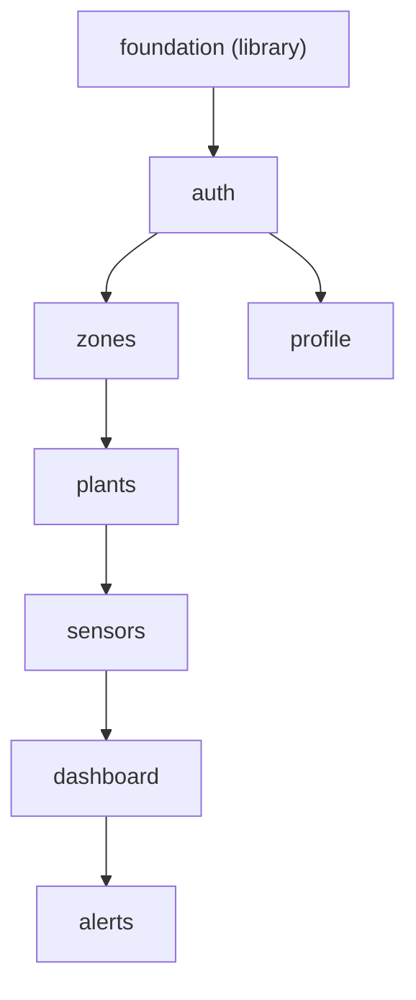

# Unit Dependency DAG — Aria Plants (Android MVP)

> Etapa 2.7 · Fase Inception · Alcance **MVP** (profundidad Estándar) · 2026-07-19
> DAG de dependencias entre las unidades de `unit-of-work.md`, derivado de
> `component-dependency.md`, `components.md`, `component-methods.md`, `services.md`,
> `decisions.md`, `requirements.md` y `stories.md`. **Topología solamente**: NO se
> elige orden de construcción ni ruta crítica (eso es Delivery Planning 2.8).

## Dependencias (dirigidas: "A depende de B")

- **foundation** → (ninguna). Base compartida.
- **auth** → foundation.
- **zones** → foundation, auth.
- **plants** → foundation, auth, zones.
- **sensors** → foundation, auth, plants.
- **dashboard** → foundation, auth, plants, sensors.
- **alerts** → foundation, auth, plants, sensors, dashboard.
- **profile** → foundation, auth.

> El adaptador `ReadingsSource` (lectura cruda de sensores) y la función pura
> `computePlantStatus` (agregación worst-case) viven en `foundation` (ADR-004/ADR-005),
> así que `sensors` (última lectura por sensor, HU-C2), `plants` (humedad de planta en
> PlantDetail) y `dashboard` (lista agregada) leen/agrupan sin depender unos de otros
> — no hay ciclo `sensors↔dashboard` ni `plants↔dashboard`.

Sin ciclos: la relación fluye de infraestructura → cuentas → catálogo (zonas→plantas→sensores) → monitoreo (dashboard→alerts); `profile` cuelga de auth.

## Diagrama


<!-- Text fallback: foundation es la raíz; auth depende de foundation; de auth salen dos ramas: profile (hoja) y zones; zones→plants→sensors→dashboard→alerts forman la cadena principal del catálogo y monitoreo. Todas dependen además de foundation (aristas de foundation omitidas del diagrama por claridad, pero presentes en el bloque yaml). `alerts` depende directamente también de plants y sensors además de dashboard (aristas directas omitidas del diagrama porque ya son alcanzables por la cadena; presentes en el bloque yaml). No hay ciclos. El bloque yaml es la fuente de verdad de las aristas. -->

## Puntos de integración entre unidades

- **foundation ↔ todas**: expone el cliente Supabase, tipos de dominio TS, config, i18n, tema y primitivos UI (contratos por tipos compartidos, Q4=A).
- **auth → todas las de datos**: la sesión activa habilita el acceso a las pantallas protegidas (shell de navegación en `foundation`) y `auth.uid()` en RLS; no todas las unidades llaman `useAuth()` directamente (lo usan `auth` y `profile`; las demás dependen de la sesión a nivel de shell/RLS).
- **zones ↔ plants**: `plants` usa `ZoneService`/`ZoneSelector` (zona-primero); `plants` es el escritor canónico de `plants.zone_id` (HU-D5).
- **plants/sensors → dashboard**: `ReadingsService` obtiene sensores de una planta (`SensorService`) y sus lecturas.
- **dashboard → alerts**: `AlertService` deriva alertas de las lecturas; persiste en tabla `alerts`.
- **profile → auth**: usa `AuthService` (logout) y config/i18n (idioma, toggle push).

## Oportunidades de paralelismo (múltiples órdenes topológicos válidos)

- Tras **foundation + auth**: **profile** es independiente de la cadena `zones→plants→sensors→dashboard→alerts` → puede construirse en paralelo (buen candidato junior, `team.md`).
- No hay otras ramas independientes (el catálogo y el monitoreo son una cadena por sus dependencias de datos).

> Nota: este documento describe SOLO la topología. La elección de qué construir
> primero (incluido el walking skeleton) y la ruta económica es de 2.8.

## Bloque de aristas (machine-readable — fuente del fan-out de batches)

```yaml
units:
  - name: foundation
    kind: library
    depends_on: []
  - name: auth
    kind: ui
    depends_on: [foundation]
  - name: zones
    kind: ui
    depends_on: [foundation, auth]
  - name: plants
    kind: ui
    depends_on: [foundation, auth, zones]
  - name: sensors
    kind: ui
    depends_on: [foundation, auth, plants]
  - name: dashboard
    kind: ui
    depends_on: [foundation, auth, plants, sensors]
  - name: alerts
    kind: ui
    depends_on: [foundation, auth, plants, sensors, dashboard]
  - name: profile
    kind: ui
    depends_on: [foundation, auth]
```
